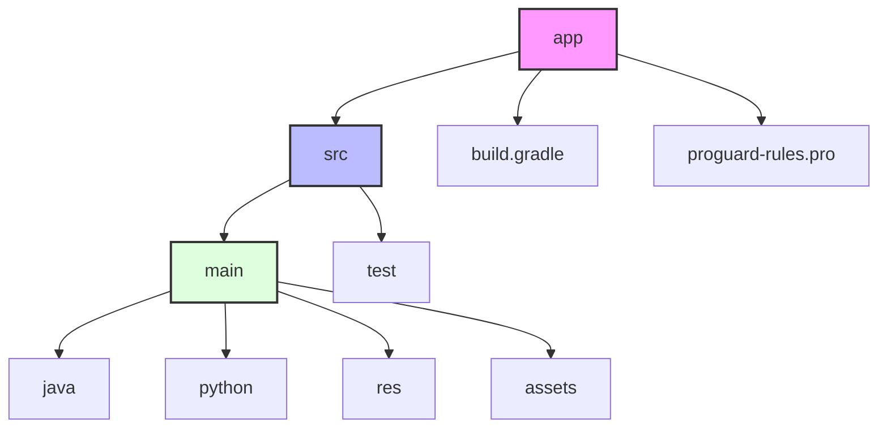

# InnoSys Implementation 🚀

<div align="center">
  
  
  [](https://developer.android.com)
  [](https://gradle.org)
  [](https://www.python.org)
  [](LICENSE)
</div>

<p align="center">A sophisticated Android application that combines native Android functionality with Python integration, providing an innovative system implementation.</p>

<div align="center">
  
</div>

## ✨ Features

<div align="center">
  <table>
    <tr>
      <td align="center">
        <br />
        <b>Native Android</b>
      </td>
      <td align="center">
        <br />
        <b>Python Integration</b>
      </td>
      <td align="center">
        <br />
        <b>Asset Management</b>
      </td>
    </tr>
  </table>
</div>

- 📱 Native Android functionality
- 🐍 Python script integration
- 🎨 Asset management system
- 💫 Modern UI/UX design
- 🌐 Cross-platform compatibility

## 🛠️ Tech Stack

<div align="center">
  
  
  
</div>

- **Android**: Native Android development with Java/Kotlin
- **Python**: Integration for advanced computations
- **Gradle**: Build system and dependency management
- **Assets**: Custom asset management for resources

## 📋 Prerequisites

<div align="center">
  <table>
    <tr>
      <th>Tool</th>
      <th>Version</th>
    </tr>
    <tr>
      <td>Android Studio</td>
      <td>Arctic Fox or later</td>
    </tr>
    <tr>
      <td>JDK</td>
      <td>11 or higher</td>
    </tr>
    <tr>
      <td>Python</td>
      <td>3.x</td>
    </tr>
    <tr>
      <td>Android SDK</td>
      <td>API level 21+</td>
    </tr>
    <tr>
      <td>Gradle</td>
      <td>7.0+</td>
    </tr>
  </table>
</div>

## 🚀 Getting Started

1. Clone the repository:
   ```bash
   git clone https://github.com/lakmina456/InnoSys_Implementation_03
   ```

2. Open the project in Android Studio

3. Sync Gradle files and resolve dependencies

4. Build and run the project on your device or emulator

<div align="center">
  
</div>

## 📁 Project Structure



## ⚙️ Configuration

<div align="center">
  <table>
    <tr>
      <th>Setting</th>
      <th>Value</th>
    </tr>
    <tr>
      <td>Minimum SDK</td>
      <td>API 21</td>
    </tr>
    <tr>
      <td>Target SDK</td>
      <td>Latest stable</td>
    </tr>
    <tr>
      <td>Build System</td>
      <td>Gradle based</td>
    </tr>
  </table>
</div>

## 👨‍💻 Development

<div align="center">
  
</div>

To contribute to the project:

1. 🍴 Fork the repository
2. 🌿 Create your feature branch
3. 💾 Commit your changes
4. 🚀 Push to the branch
5. 📬 Create a Pull Request

## 📄 License

This project is licensed under the MIT License - see the [LICENSE](LICENSE) file for details.

## 👥 Contributors

<div align="center">
  <a href="https://github.com/lakmina456">
    
    <br />
    <sub><b>Lakmina</b></sub>
  </a>
</div>

## 💬 Support

<div align="center">
  <a href="https://github.com/lakmina456/InnoSys_Implementation_03/issues">
    
  </a>
  <a href="https://github.com/lakmina456/InnoSys_Implementation_03/network">
    
  </a>
  <a href="https://github.com/lakmina456/InnoSys_Implementation_03/stargazers">
    
  </a>
</div>

For support and queries, please [create an issue](https://github.com/lakmina456/InnoSys_Implementation_03/issues) or contact the development team.

---
<div align="center">
  Built with ❤️ for innovation and efficiency
  <br/>
  
</div>
