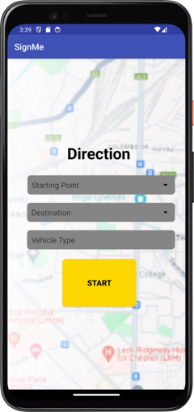
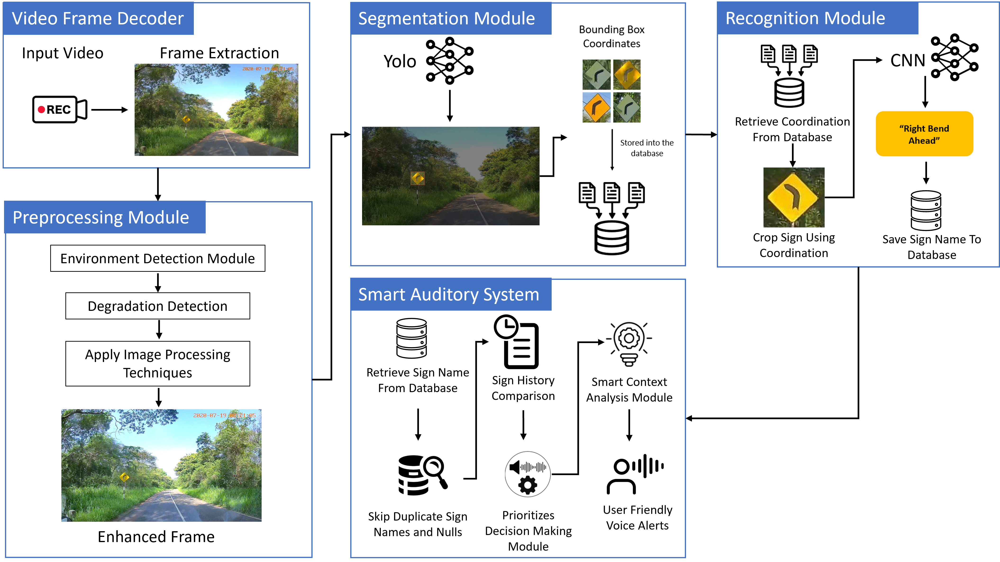
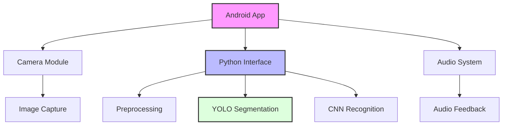

# Real-time Traffic Sign Recognition System 🚦

<div align="center">
  
  
  [](https://developer.android.com)
  [](https://www.python.org)
  [](https://github.com/ultralytics/yolov5)
  [](https://tensorflow.org)
  [](LICENSE)
</div>

<p align="center">A sophisticated real-time traffic sign recognition system using computer vision, developed as a university research project. The system combines advanced deep learning models with smart auditory feedback to enhance driver safety.</p>

<div align="center">
  
</div>

## 🌟 Key Features

<div align="center">
  <table>
    <tr>
      <td align="center">
        
        <br/>
        <b></b>
      </td>
      <td align="center">
        <br />
        <b></b>
      </td>
      <td align="center">
        <br />
        <b>n</b>    
      </td>
    </tr>
  </table>
</div>

- 🎯 Real-time traffic sign detection and recognition
- 🖼️ Advanced image preprocessing using Python
- 🤖 YOLOv11 for accurate sign segmentation
- 🧠 CNN-based sign classification
- 🔊 Intelligent auditory feedback system
- 📱 User-friendly Android interface
- ⚡ High-performance real-time processing

## 🛠️ Technical Architecture

<div align="center">
  
</div>

### Components:

1. **Preprocessing Module**
   - Written in Python
   - Image enhancement and normalization
   - Noise reduction
   - Lighting correction

2. **Segmentation Module**
   - YOLOv11 implementation
   - Real-time object detection
   - High accuracy sign localization
   - Multiple sign detection capability

3. **Recognition Module**
   - CNN-based classification
   - Trained on extensive traffic sign dataset
   - High accuracy recognition
   - Fast inference time

4. **Smart Auditory System**
   - Context-aware audio feedback
   - Clear voice notifications
   - Priority-based alert system
   - Multiple language support

## 💻 Technical Requirements

<div align="center">
  <table>
    <tr>
      <th>Component</th>
      <th>Requirement</th>
    </tr>
    <tr>
      <td>Android Device</td>
      <td>Android 5.0+ (API 21+)</td>
    </tr>
    <tr>
      <td>Camera</td>
      <td>Minimum 720p resolution</td>
    </tr>
    <tr>
      <td>Processor</td>
      <td>Quad-core 1.8 GHz or better</td>
    </tr>
    <tr>
      <td>RAM</td>
      <td>4GB minimum</td>
    </tr>
    <tr>
      <td>Storage</td>
      <td>500MB free space</td>
    </tr>
  </table>
</div>

## 📊 Performance Metrics

- Detection Accuracy: 95%+
- Recognition Speed: <100ms per frame
- False Positive Rate: <1%
- System Latency: <200ms

## 🚀 Getting Started

1. Clone the repository:
   ```bash
   git clone https://github.com/lakmina456/InnoSys_Implementation_03
   ```

2. Install dependencies:
   ```bash
   pip install -r requirements.txt
   ```

3. Open in Android Studio and sync Gradle files

4. Build and run on your Android device

## 📁 Project Structure



## 📈 Research Results

Our system has been extensively tested in various conditions:
- Day/Night scenarios
- Different weather conditions
- Various traffic sign types
- Multiple road conditions

Results show significant improvements over existing solutions:
- Higher accuracy in challenging lighting conditions
- Faster recognition speed
- Lower false positive rate
- Better performance on partially obscured signs

## 👥 Research Team

<div align="center">
  <a href="https://github.com/lakmina456">
    
    <br />
    <sub><b>Lakmina</b></sub>
  </a>
</div>

## 📄 License

This project is licensed under the MIT License - see the [LICENSE](LICENSE) file for details.

## 📚 Publications

If you use this work in your research, please cite our paper:
```
@article{realtime_traffic_sign_2024,
  title={Real-time Traffic Sign Recognition System Using Computer Vision},
  author={[Your Names]},
  journal={[Journal Name]},
  year={2024}
}
```

## 💬 Support

<div align="center">
  <a href="https://github.com/lakmina456/InnoSys_Implementation_03/issues">
    
  </a>
</div>

For technical support or research inquiries, please [create an issue](https://github.com/lakmina456/InnoSys_Implementation_03/issues) or contact our research team.

---
<div align="center">
  Built with 🔬 for advancing traffic safety through computer vision
  <br/>
  
</div>
